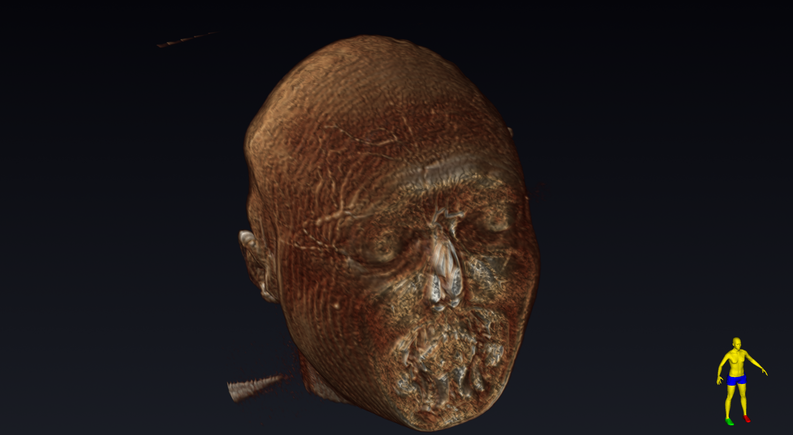
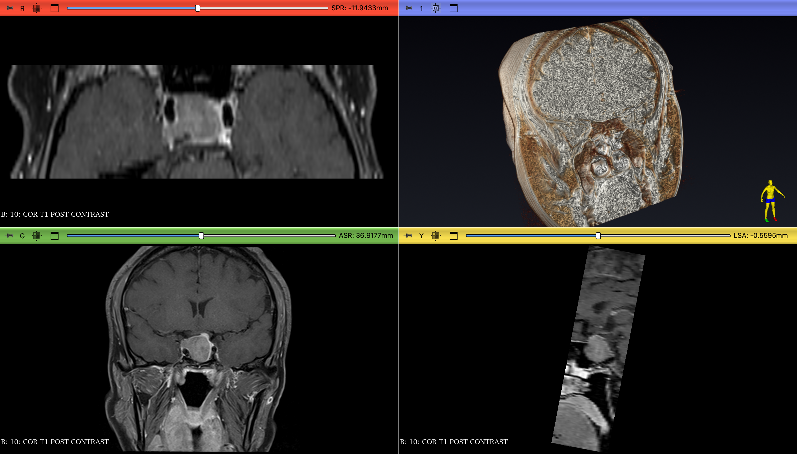

# 3D Slicer — Scripted Brain MRI Volume Rendering

A reproducible [3D Slicer](https://www.slicer.org/) scene built entirely from Python: it imports a multi-series brain MRI DICOM study, applies MR volume-rendering presets, configures a clean clinical layout, and captures high-resolution renders — with no manual clicking in the GUI.

The point of this sample is not a single picture; it is the **automation pipeline** (`scripts/build_scene.py`) that produces the scene deterministically from raw DICOM.

---

## Renders

### Volume render — anatomical surface (FLAIR series)
A head reconstructed by volume rendering the FLAIR acquisition, shown from a 3/4 oblique angle with a studio background and orientation marker.



### Volume render — contrast-enhanced T1
The post-contrast T1 series. Its limited through-plane coverage (~48 mm) is visible as a cross-sectional slab — an honest reflection of a clinical 2D acquisition rather than an isotropic volume.


### Four-up MPR + 3D
Standard radiology layout: axial, coronal, sagittal multiplanar reconstruction alongside the 3D volume.



---

## What the pipeline does

`scripts/build_scene.py`:

1. **Imports** every series of a DICOM study into a temporary Slicer DICOM database.
2. **Selects volumes programmatically** — picks the hero volume by 3D coverage (through-plane extent) and a secondary volume by in-plane resolution / contrast.
3. **Applies volume rendering** using Slicer's `MR-Default` transfer-function preset, copied onto each volume's property node.
4. **Positions the camera** at a computed 3/4 oblique angle from the volume's RAS bounds, for a consistent presentation view.
5. **Captures** high-resolution PNGs of the 3D view and the four-up MPR layout via `ScreenCapture`.
6. **Saves** the entire scene as a portable `.mrb` bundle.

`scripts/finalize_scene.py` reopens the saved bundle, sets a polished default view, and re-saves — so the `.mrb` opens straight to the showpiece render.

## Run it

```bash
Slicer --python-script scripts/build_scene.py
```

(Requires 3D Slicer 5.x. Point `DICOM_DIR` at a DICOM study directory.)

---

## A note on the data

The input is a clinical brain MRI: anisotropic 2D acquisitions (15–30 slices, 2–4 mm thick), not a high-resolution isotropic volume. The FLAIR series has enough through-plane coverage for a convincing head render; the thinner contrast series renders as a slab. This is a deliberate, documented limitation of the source data — the pipeline itself is dataset-agnostic and will produce a comparable scene from any volumetric DICOM study.
